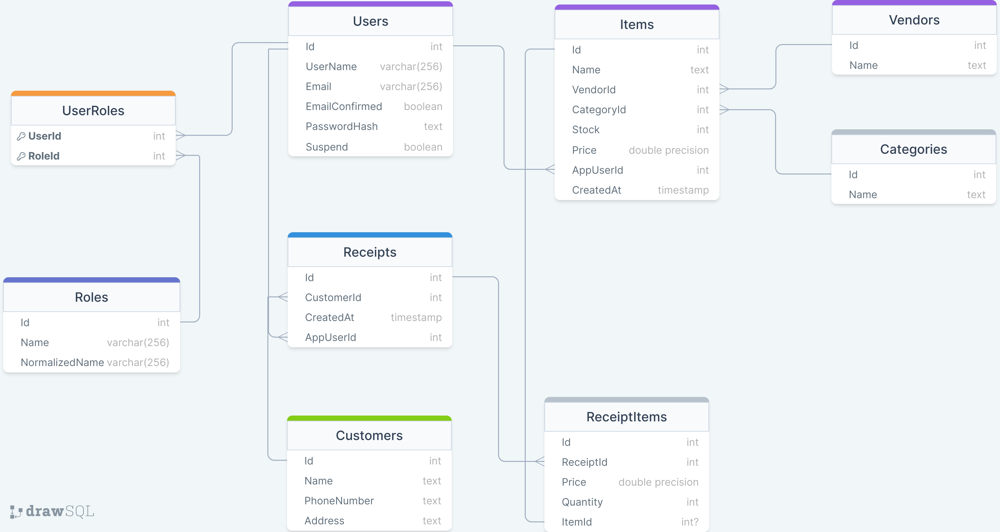
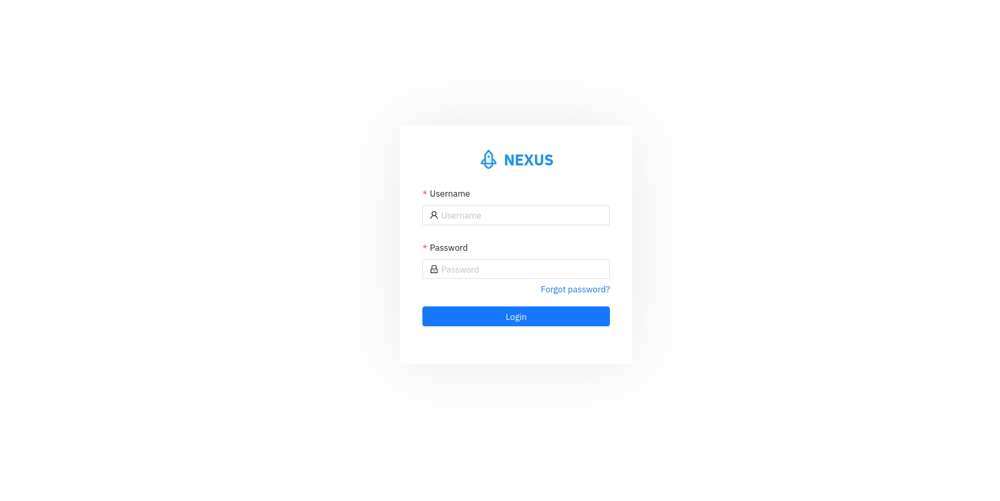
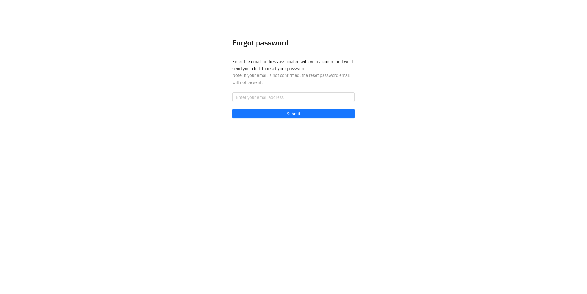
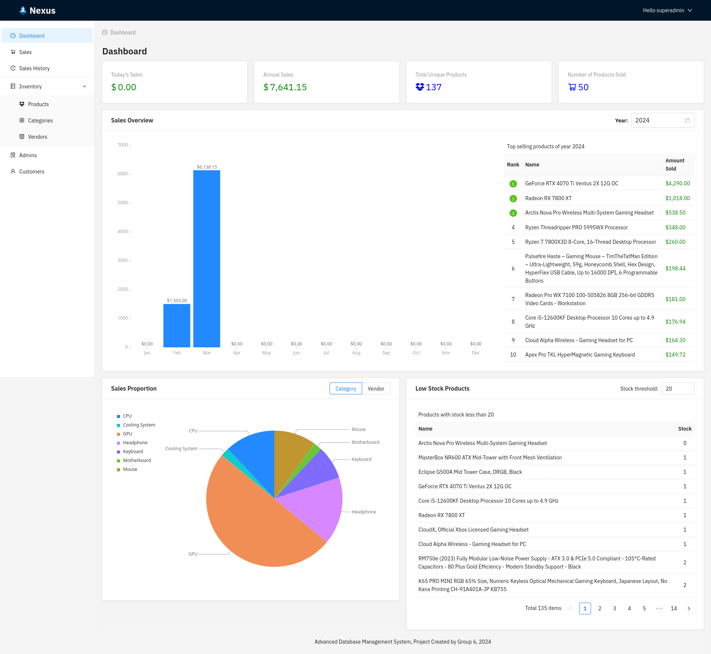
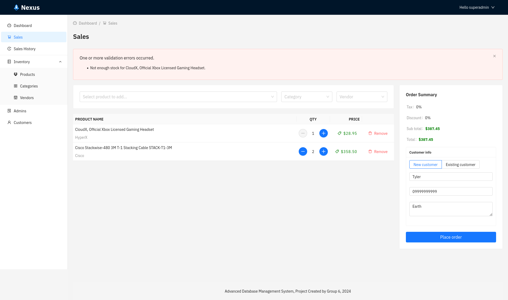
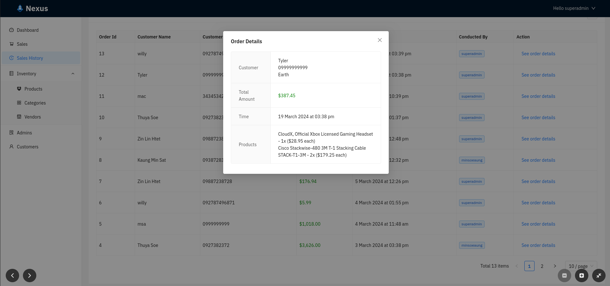
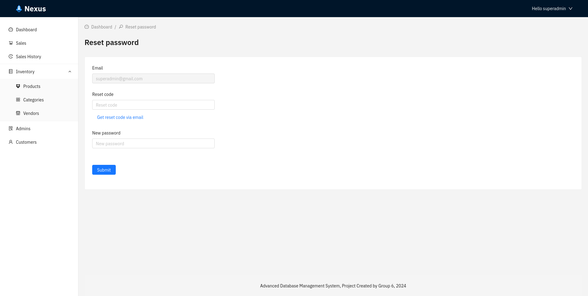
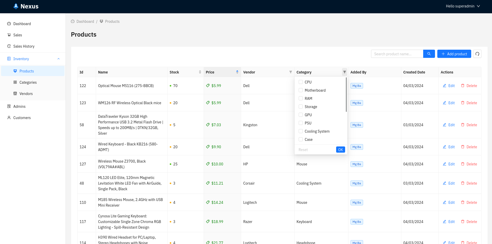
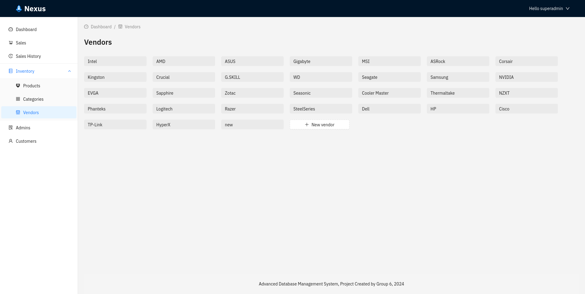

# Point of Sale (POS) - Nexus

## Quick Shortcuts

- [Overview](#)
- [Features](#-features)
- [ER Diagram](#-er-diagram)
- [Technologies used](#-technologies-used)
- [Setup & run](#-setup--run)
- [Screenshots](#-screens)
    - [Login](#-login)
    - [Forgot password](#-forgot-password)
    - [Dashboard](#-dashboard)
    - [Sales](#-sales)
    - [Sales History](#-sales-history)
    - [Reset password](#-reset-password)
    - [Products](#-inventoryproduct)
    - [Vendors](#-inventoryvendor)

## # Overview

Nexus is a Point of Sale (POS) system built with C# and modern web technologies like ASP.NET Core 8.0 Web API with Entity Framework Core for data access and Identity endpoints for authentication. The frontend is built with ReactJS and libraries like React Query and React Router.
 

## # Features

- **User Management** (users with **SuperAdmin** role only):
  - Create admin accounts 
  - Suspend admins 
- **Inventory Management**:
  - Create, read, update, and delete (CRUD) products 
  - Create, read, update, and delete (CRUD) categories 
  - Create, read, update, and delete (CRUD) vendors 
- **Account Management**:
  - Reset password 
  - Forgot password functionality 
  - Confirm email address
- **Sales Management**:
  - Make sales 
  - View sales history
- **Customer Data**:
  - View customer data (includes information collected during sales)
- **General Features**:
  - View dashboard (provides insights into sales data)

## # ER Diagram

## # Technologies Used

- [ASP.NET Core Web API (8.0)](https://dotnet.microsoft.com/en-us/download/dotnet/8.0)
- [Entity Framework Core](https://learn.microsoft.com/en-us/ef/core/)
- [Microsoft Identity Platform](https://learn.microsoft.com/en-us/entra/identity-platform/)
- [ReactJS](https://react.dev/)
- [React Query](https://tanstack.com/query/latest/docs/framework/react/overview)
- [React Router](https://reactrouter.com/en/main)
- [Ant Design](https://ant.design/)

## # Setup & Run

> **Need to Have**:
 [.NET 8.0](https://dotnet.microsoft.com/en-us/download/dotnet/8.0)
 [Node.js (v20 on my machine)](https://nodejs.org/en/download/current)
 [PostgreSQL (v15.4 on my machine)](https://www.postgresql.org/download/)

#### Step - 1: Clone

- `git clone https://github.com/minsoeaung/nexus-pos/`

#### Step - 2: App Settings

- Create a PostgreSQL database for the application.
  - And update the "connectionString" value in Backend/appsettings.json with your database connection details or set it
    through ***dotnet user secrets***
    - In Backend folder,
        - `dotnet user-secrets set "Psql:connectionString" "Host=localhost;Port=5432;Database=<database_name>;User Id=<username>;Password=<password>;Include Error Detail=true"`
- Create or use existing gmail account for the app to be able to send email
    - Update "Mail", "DisplayName", and "Password" in Backend/appsettings.json

#### Step - 3: Restore Packages

- In Backend folder,
  - `dotnet restore`
- In Frontend folder,
  - `npm install`

#### Step - 4: Running the app

- In Backend folder,
    - `dotnet run`
- In Frontend folder,
    - `npm run dev`

#### Step - 5: Using the app

- Now, can use the application on `http://localhost:3000/`
- With these initially generated accounts
    - username: superadmin, password: password
    - username: admin, password: password

## # Screens

### **# Login**

### **# Forgot Password**

### **# Dashboard**

### **# Sales**

 

### **# Sales History**

 

### **# Reset Password**

### **# Inventory.Products**

### **# Inventory.Vendors**

### Caution

- All logics within the controller.
- Both access and refresh tokens are stored in localStorage.

## Thank You.

